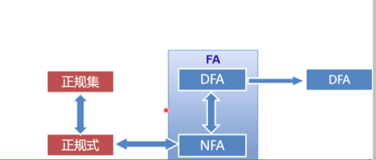
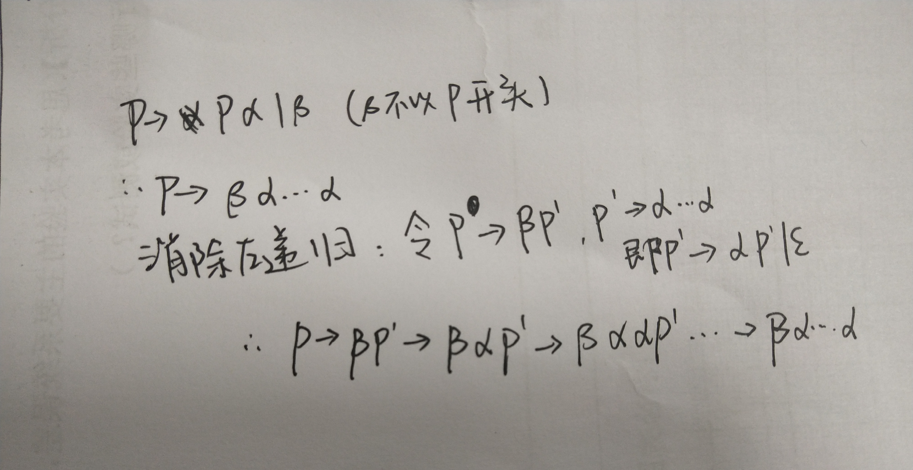
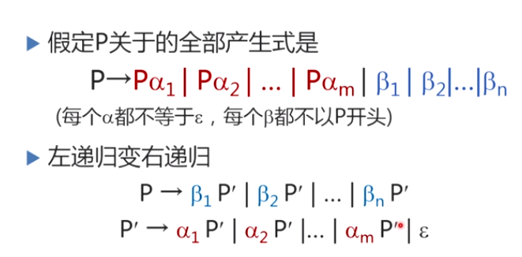
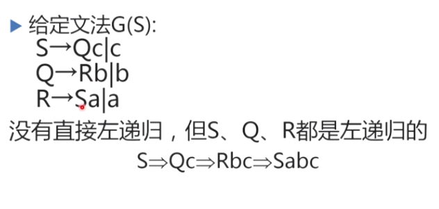
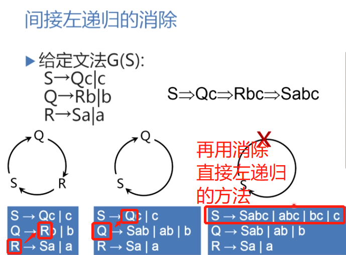
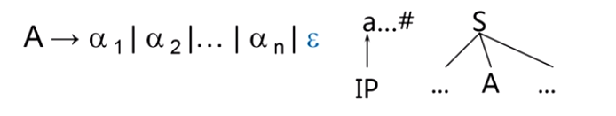
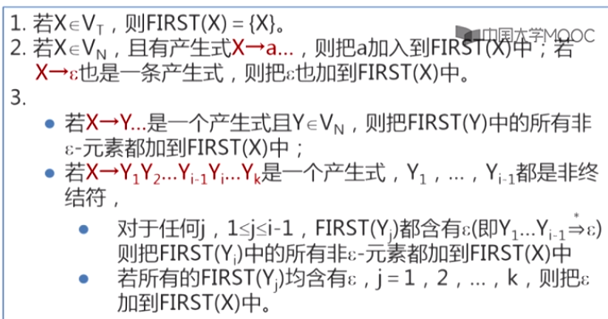
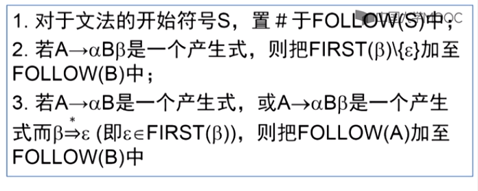

**文法**

expr表达式expression

stmt句子statement

 推到和规约

直接推导：用产生式的右边代替产生式的左边

 

1型文法，即上下文有关文法

2型文法，即上下文无关文法

3型文法，即正则文法

分析树

根节点的标号为文法开始符号

分析树的叶子结点构成短语

词法分析（lex）——语法分析——语义分析与中间代码生成——优化——目标代码生成

- ## 词法分析

扫描源程序，产生一个单词符号

词法分析器用于执行词法分析的程序，也叫扫描器（输入源程序，输出单词符号，如语言中的关键字、标识符、常数、运算符、分界符）

确定有限自动机DFA（有一个唯一的初态，允许没有终止状态）

确定：指的是一个状态下，一个输入，只会有一个输出

 DFA M所识别的字的全体记为L(M) 

非确定有限自动机NFA（给一个输入，后继状态不唯一）

 DFA是NFA的特例

正规集、正规式：字母表上一些符号串的集合

正规式与NFA可以相互转换

词法分析器的自动测试工具lex：

①对照语言的词汇表（即正规集），写出各类单词的正规式，

②利用正规式到nfa转换算法算出所有单词的nfa

③利用nfa到dfa的转换算法，得到所有单词的dfa

④将dfa的状态转移函数实现为二维数组，并和dfa的执行程序组合起来，得到依法分析程序

lex工作过程

- ## 语法分析

  任务：分析文法的句子的结构

  语法分析器的功能：按照文法的产生式（语法规则），识别输入符号穿是否为一个句子（是否为形式上正确的程序）

  语法分析器的输出：树形结构或布尔

  1. 自上而下（如LL，预测分析法，递归下降法）

  从文法开始符号出发，反复使用产生式，寻找匹配的推导。（自上而下为输入串建立语法树）

  可能会产生的问题：

  ①文法**左递归**问题：P=>Pα（可能导致死循环）

  消除直接左递归：

  

  

  间接左递归

  

  消除方法（使用条件：不含以空船为右部的产生式、不含回路）：

  

  

  ②**回溯**问题

  G是一个不包含左递归的文法，G的所有非终结符的每个候选α定义为他的终结首符集**FIRST(α)**，根据first集来选择用哪一个候选，所以要**提取左公因子**使各α的first集尽量不相交。

  **FOLLOW(A)**：能够在某个句型里面跟在A后面的终结符

  例：在如下图情况中，A组要扩展匹配除a，又a不再A的first候选集和中，如果a在A的follow集合里，就用空串来途欢A。

  

  ==如果S=>...A，则规定#∈follow(A)==

  连续使用产生式，直至follow集不再变化

   first集和follow集的计算

  first:

  

  

  follow:

  

  预测分析法

  预测分析表：

  （以正确计算出first和follow集）

  ①存在a∈FIRST(α)

  A->α要放在A那一行，first(α)集合中的所有元素所在的列 

  ②空∈first(α)

  A->α要放在A那一行，follow(A)中所有元素所在的列

   ==LL(1)文法=>预测分析表中一个格仅有一个产生式（即不存在多重定义入口）==

  2. 自下而上（如LR）

  从输入串开始**归约**直到文法的开始符号（从叶结点开始建立语法树）

  移进——归约

  LR分析法：

  产生分析表——语法分析

  